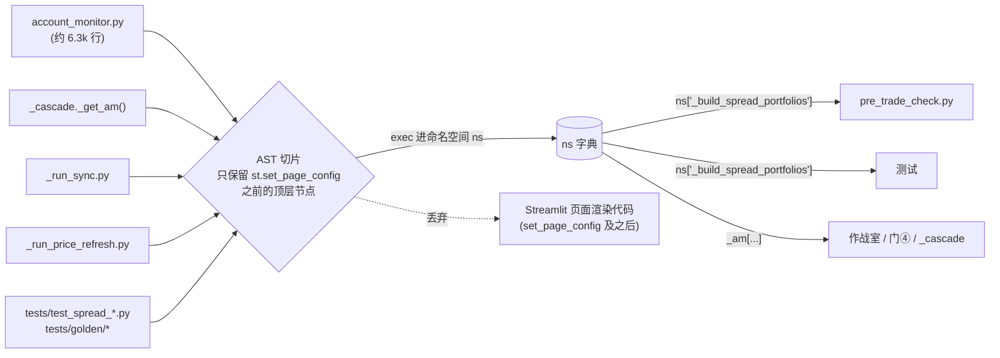
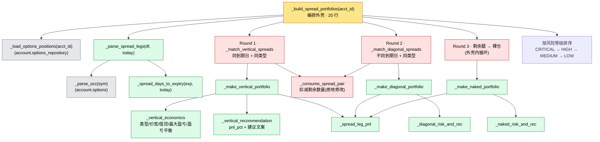
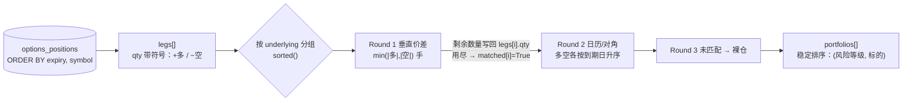

# 期权组合识别引擎架构（`_build_spread_portfolios`）

> 2026-09-21 重构后的结构说明。对应提交：`9656d36`（黄金快照测试）、`e492673`（拆分）。
> 本次是**纯结构重构，行为不变**：输出的每个字段、字段顺序、建议文案都与重构前逐字节一致，
> 由 `tests/golden/test_build_spread_portfolios_golden.py` 锁定。
> 属于 `docs/GLOBAL_AUDIT_2026-09-10.md` §5.1"渐进拆分 `account_monitor.py`"的第一步。

## 1. 加载规则：辅助函数必须写在 `st.set_page_config` 之前

`account_monitor.py` 不是通过 `import` 调用的。5 个加载器用 AST 切片的方式，只执行
`st.set_page_config` 那一行**之前**的顶层定义，然后按**字典键**取函数：

**约束**：
- 新的私有辅助函数如果定义在 `st.set_page_config` 之后，加载器看不到它，运行时会 `NameError`。
- 因为是字典键访问，`export_sanity.py` 这类静态分析**看不到**这些调用方，必须手动 Grep
  `_am["` / `ns["`。
- `_build_spread_portfolios(acct_id: str) -> list[dict]` 的名字和签名是对外契约，不能改。

## 2. 调用结构

原来是一个 289 行、79 个分支的函数，里面嵌着 3 个闭包。现在拆成 20 行的编排外壳加 13 个
模块级私有辅助函数，最长的 35 行：

图例：黄色是编排外壳，绿色是纯函数（只读入参），红色会原地修改 `legs` / `matched`，
灰色是外部依赖（没有改动）。

## 3. 配对数据流（按标的逐组处理）

**顺序敏感点**（重构时必须保持）：
- 每个组合的 `legs` 字段是**调用那一刻**的腿拷贝（`dict(li=..., **leg)`）。前面的配对已经扣减过
  `qty`，所以后面组合拿到的是剩余数量。
- 结果的追加顺序决定了同风险等级、同标的条目的最终排列（`sort` 是稳定排序）。
- 浮点运算的顺序（例如 `_spread_leg_pnl(ll, f) + _spread_leg_pnl(sl, f)`）不能调换。

## 4. 辅助函数一览

| 函数 | 有效行数 | 纯函数 | 职责 |
|---|---|---|---|
| `_spread_days_to_expiry` | 5 | 是 | 到期剩余天数；日期非法（例如月份 13）返回 9999 |
| `_spread_leg_pnl` | 7 | 是 | 单腿盈亏；无现价时退回 `total_pnl` |
| `_parse_spread_legs` | 28 | 是 | 解析持仓行；兼容旧库 `direction="short"` 加正数量的写法 |
| `_vertical_economics` | 29 | 是 | 垂直价差的类型、价宽、借/贷方向、最大盈亏、盈亏平衡点 |
| `_vertical_recommendation` | 20 | 是 | 借方按成本、贷方按风险资本计 `pnl_pct`，并生成文案 |
| `_make_vertical_portfolio` | 35 | 是 | 组装垂直价差条目 |
| `_diagonal_risk_and_rec` | 20 | 是 | 判断顺序：近月临期 → 反向 → 近月待复核 → 正常 |
| `_make_diagonal_portfolio` | 35 | 是 | 组装日历/对角价差条目 |
| `_naked_risk_and_rec` | 18 | 是 | 买权 / 裸卖 Put / 裸卖 Call 的风险等级和文案 |
| `_make_naked_portfolio` | 28 | 是 | 组装裸仓条目 |
| `_consume_spread_pair` | 12 | **否** | 配对后扣减剩余数量，替代原来两份相同的代码 |
| `_match_vertical_spreads` | 21 | **否** | Round 1 |
| `_match_diagonal_spreads` | 23 | **否** | Round 2 |
| `_build_spread_portfolios` | 20 | — | 编排外壳（签名不变） |

## 5. 测试与防护

- **黄金快照**：`tests/golden/test_build_spread_portfolios_golden.py`，25 个合成场景，日期冻结在
  2026-09-21（freezegun），快照按字段原顺序做全量比对。快照缺失时直接失败，不会自动生成。
  - 只有在**未修改的原始代码**上才能重新生成：`UPDATE_GOLDEN=1 python -m pytest tests/golden -q`
- **分支覆盖**：94 个分支覆盖了 90 个。剩下 4 个是结构上走不到的防御性 `continue`，原样保留：
  - `_match_vertical_spreads` 分组时的 `if matched[i]`
  - 两轮配对外层循环里的 `if matched[li]`
  - Round 2 的"同到期日跳过"（Round 1 已经把同到期日的多空配完了）
- **反向验证**：把裸仓文案里的一个字改掉，原有 27 个价差测试**仍然全绿**，黄金快照有 7 个变红。
  这说明只靠原有测试，文案或风险等级的回归是发现不了的。
- 开发依赖：`requirements-dev.txt`（pytest / freezegun / pytest-cov）

## 6. 已知问题（本次按原样保留，未修复）

- **价格字段部分缺失时盈亏算成 NaN**（快照已核实）：同一账户里某列有的行有值、有的是 NULL 时，
  pandas 会把 NULL 读成 `NaN` 而不是 `None`，`is not None` 判断因此失效。有两种表现：
  - `current_price` 缺失的腿不会退回 `total_pnl`，组合的 `current_pnl` / `pnl_pct` 变成 NaN
    （快照 `mixed_missing_current_price`）
  - `total_pnl` 也缺失时，NaN 是真值，`(total_pnl or 0)` 不会退回 0，`current_pnl` 同样是 NaN
    （快照 `no_current_price_falls_back_to_total_pnl` 里的 FTNT 裸卖 Put）

  修复会改变输出，应作为独立任务处理，并同步更新这两个快照。
- **`tests/test_spread_pairing.py` 的到期日写死了**：`260919` 在 2026-09-19 已经过期，DTE
  变成负数。测试仍然通过，是因为它不断言风险等级。已登记为待办。
- **后续拆分候选**（GLOBAL_AUDIT §5.1）：`_compute_risk_snapshot`、`_compute_iv_regime`、
  `_compute_sim_impact`，最终目标是删掉 `_get_am()`。
