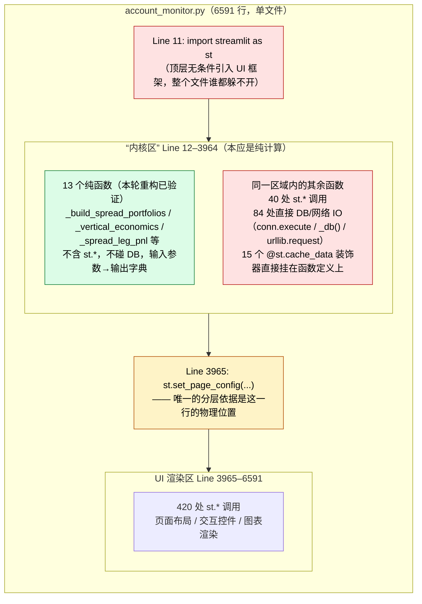
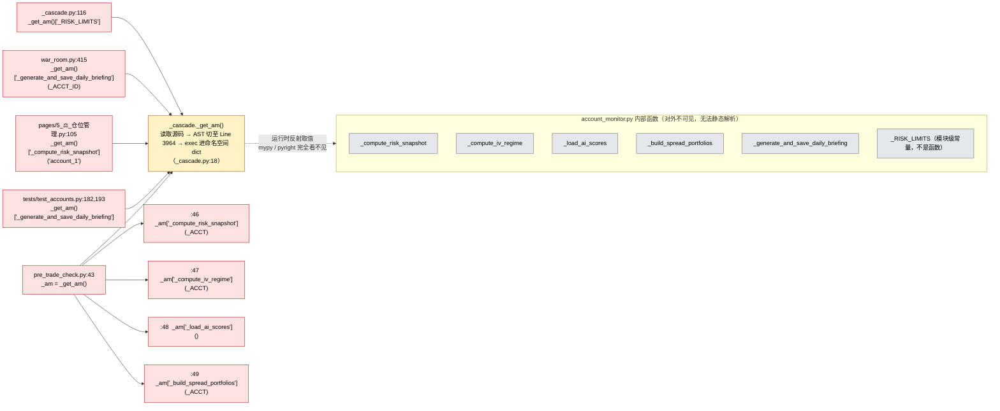
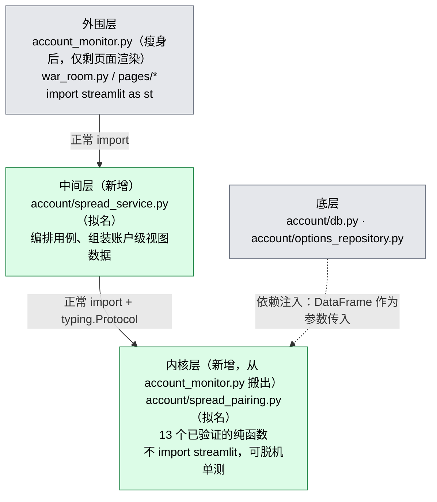

# `account_monitor.py` 架构诊断（现状，重构前基线）

> 按 `arch` 第四节的规范落盘：这是**细节数据流与算法拓扑图**，主文档
> （`docs/REFACTORING_WORKFLOW.md`）只保留一句话索引，不堆细节。
> 本文档对应 `REFACTORING_WORKFLOW.md` **阶段一：架构侦察与契约设计** 的产出物，
> 是启动流水线第一阶段的起点快照，不是重构方案本身。
>
> 诊断日期：2026-09-22。诊断方法：静态行数统计 + grep 调用点扫描，全部数字可
> 用文末命令复现。

## 一句话结论

`account_monitor.py` 同时是内核、中间层、外围层——`arch` 定义的三层拓扑在这个
文件里完全没有物理边界，只有一条**人为的行号分界线**（`st.set_page_config`
所在行）在假装分层。

---

## 1. 内核区的 UI/IO 混入



**读图要点**：绿色的 13 个函数已经具备搬到独立内核模块的资格（本次
`_build_spread_portfolios` 重构验证过）；红色部分是"内核区"里名不副实的另一
半——它们和 UI 渲染区之间唯一的区别只是"在 3965 行之前"，逻辑上仍然依赖
Streamlit 的运行时环境（`@st.cache_data` 需要 Streamlit 的 session 上下文才
能正常工作，脱离 Streamlit 单测这些函数时该装饰器直接失效或报错）。

---

## 2. 跨模块反射调用链路

`account_monitor.py` 从未被其他模块 `import` 过——它不能被 `import`，因为顶层
`import streamlit as st` 加上 6591 行的页面渲染代码，正常导入会直接尝试跑
Streamlit 页面。于是所有需要用到它内部函数的调用方，都绕开了 Python 正常的
模块系统，改用"AST 切片 + `exec` + 字典键取值"。



**读图要点**：这不是一次性技术债，是**5 个不同文件的标准调用方式**。任何一个
函数名打错字、任何一次参数签名变更，都只有真正跑到那一行代码时才会在运行时
炸出 `KeyError` 或 `TypeError`——`arch` 第三节"显式契约"要求的静态类型检查，
在这条链路上完全失效。

---

## 3. AST 切片加载器：7 处独立重复实现

比反射调用更麻烦的是：这套"读源码 → AST 切片 → exec"的逻辑，**没有被封装成
一个真正共享的工具函数**——`_cascade._get_am()` 只是七份几乎相同实现里"恰好
被其他文件调用"的那一份，其余六个文件各自把同一段逻辑重新抄了一遍：

| 文件 | 用途 |
|---|---|
| `_cascade.py`（`_get_am()`） | 供 `war_room.py`、`pages/*`、部分测试共享调用的"官方"入口 |
| `_run_sync.py` | 独立复制一份，供同步脚本直接调用 `_init_db()` 等 |
| `_run_price_refresh.py` | 独立复制一份，供价格刷新脚本调用 |
| `scripts/diagnose_sync.py` | 独立复制一份，诊断工具用 |
| `tests/test_spread_pairing.py` | 独立复制一份，测试用（本次重构前就存在） |
| `tests/test_spread_calculations.py` | 独立复制一份，测试用 |
| `tests/test_sell_call_trigger_coverage.py` | 独立复制一份，测试用 |
| `tests/golden/test_build_spread_portfolios_golden.py` | 本次重构新增的黄金快照测试，**沿用了同样的技术**（保持与现有测试一致的加载方式，未引入新问题，但也未修正旧问题） |

**这意味着**：`st.set_page_config` 那一行如果被移动、删除、或者改了一个字，
需要**同步检查并修改 7 个文件**里各自硬编码的切片逻辑，没有任何一处会自动
连带更新，也没有测试专门覆盖"这 7 份实现是否互相一致"。

---

## 4. 目标状态（重构方向，供阶段三参考）



搬迁完成后，本文档第 2、3 节里的每一处反射调用都应该替换为对
`account.spread_pairing` 的正常 `import`；`_get_am()` 和另外 6 份重复实现最终
应当整体删除（呼应 `docs/GLOBAL_AUDIT_2026-09-10.md` §5.1 的既定方向）。

---

## 复现本文档数字的命令

```bash
wc -l account_monitor.py
grep -n "^st.set_page_config" account_monitor.py

awk 'NR<3965 && /st\./{c++} END{print c}' account_monitor.py   # 内核区 st. 调用
awk 'NR>=3965 && /st\./{c++} END{print c}' account_monitor.py  # UI区 st. 调用
awk 'NR<3965' account_monitor.py | grep -cE "conn\.execute|_db\(\)|urllib\.request|requests\.(get|post)"
awk 'NR<3965' account_monitor.py | grep -c "@st\.cache"

grep -rn '_get_am()\["\|_am\["' --include=*.py . | grep -v _archive
grep -rln "getattr(n, .lineno., 0) < " --include=*.py . | grep -v _archive
```
