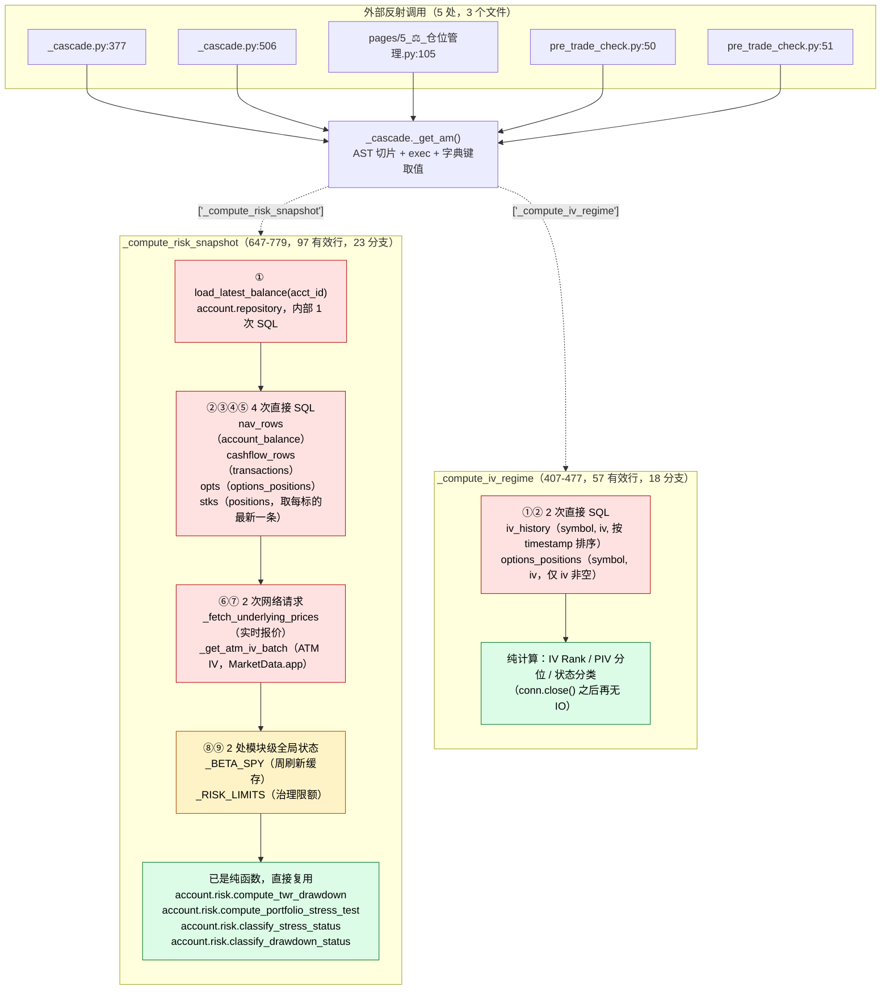
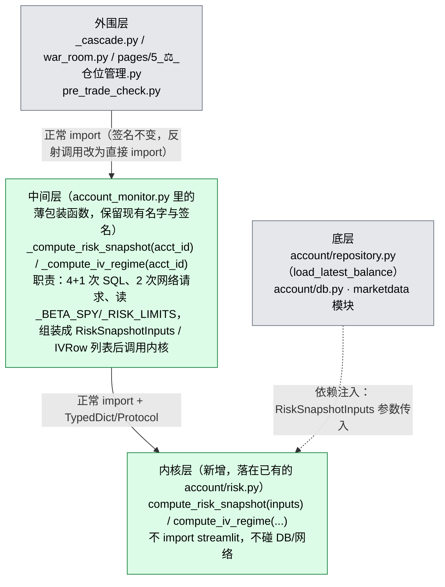

# `_compute_risk_snapshot` / `_compute_iv_regime` 架构诊断与契约草案

> 阶段一：架构侦察与契约设计（`docs/REFACTORING_WORKFLOW.md`）。
> Audit Gate：本文档是**只读分析 + 契约草案**，未写任何测试、未触碰
> `account_monitor.py` 的真实业务代码。契约审查通过后才进入阶段二。
>
> 诊断日期：2026-09-23。方法：逐行阅读源码 + 追踪每个外部调用的定义，
> 不是行数统计脚本能替代的——这两个函数的依赖链比 `spread_pairing` 复杂
> 得多，得把每一个 DB 查询、每一次网络请求、每一处全局变量读取都点名。

## 一句话结论

两个函数都不是"从头脏到尾"——**IO 全部集中在函数开头，后半段已经是纯计算**，
而且它们调用的 4 个辅助函数（`compute_twr_drawdown`、`compute_portfolio_stress_test`、
`classify_stress_status`、`classify_drawdown_status`）**已经在 `account/risk.py`
里是纯函数**，不需要重新写。这次的活主要是**把"函数开头那段 IO"搬到调用方**，
而不是重写整个函数体。

## 一个需要更正的数字

上一轮我口头提到"14 处 DB IO、5 处反射调用"——反射调用的 5 处经核对**准确**；
但逐行数下来，真实的"不纯"来源是 **9 次数据获取操作 + 2 处全局变量读取 = 11
个不纯点**，不是 14。此前的数字来自更粗糙的字符串计数（会把 `conn.execute(`
同时算进 `conn\.execute` 和 `\.execute\(` 两个模式，重复计数）。下面所有数字
都是逐行核对过的。

---

## 1. 现状拓扑图



**读图要点**：`_get_am()` 这一条反射链路，`_compute_risk_snapshot` 独占 4 处
调用（全库最重），`_compute_iv_regime` 1 处。绿色部分（4 个 `account.risk`
纯函数）已经具备被复用的条件，不需要动；红色和黄色部分才是这次要搬的东西。

---

## 2. 依赖清单（供阶段三实施对照）

### `_compute_risk_snapshot` 的 9 个数据源

| # | 来源 | 取的字段 | 现状调用 |
|---|---|---|---|
| 1 | `account.repository.load_latest_balance(acct_id)` | `total_equity`, `sync_time`（及 `account_balance` 表其余列） | 已是独立函数，内部 1 次 SQL |
| 2 | SQL：`account_balance` | `DATE(sync_time) AS d, total_equity`，按 `_RISK_LIMITS["drawdown_start_date"]` 过滤 | 直接 `conn.execute` |
| 3 | SQL：`transactions` | `trade_date, SUM(amount) AS cf`，`type IN ('提款','存款','DEPOSIT','WITHDRAWAL')` | 直接 `conn.execute` |
| 4 | SQL：`options_positions` | `symbol, quantity, current_price, market_value, strike, expiry`，`current_price IS NOT NULL` | 直接 `conn.execute` |
| 5 | SQL：`positions`（自连接取每标的最新同步） | `symbol, quantity, market_value`，`position_type='stock'` | 直接 `conn.execute` |
| 6 | `_fetch_underlying_prices(tickers)` | 实时报价 | 网络请求（MarketData.app，经 `_fetch_underlying_prices_md`） |
| 7 | `_get_atm_iv_batch(tickers)` | ATM IV | 网络请求（同上，带 `_MD_KEY`） |
| 8 | `_BETA_SPY`（全局） | `{标的: beta}` | 模块导入时算好，之后是内存字典 |
| 9 | `_RISK_LIMITS`（全局） | 治理限额 dict | 同上 |

### `_compute_iv_regime` 的 2 个数据源

| # | 来源 | 取的字段 |
|---|---|---|
| 1 | SQL：`iv_history` | `symbol, iv`，按 `timestamp` 排序 |
| 2 | SQL：`options_positions` | `symbol, iv`，`iv IS NOT NULL` |

### 已确认纯净、可直接复用的 4 个函数（`account/risk.py`，无 streamlit 依赖）

`compute_twr_drawdown(nav_by_date, cashflow_by_date=None) -> float`
`compute_portfolio_stress_test(stocks, options, *, underlying_prices, iv_map, beta_map, today=None) -> dict`
`classify_stress_status(stress_10_ratio, limits=None, stress_20_ratio=None) -> str`
`classify_drawdown_status(drawdown, limits=None) -> str`

**发现一个顺手的收尾项（本轮不做，记录待办）**：`compute_portfolio_stress_test`
已经支持 `today: datetime.date | None = None` 参数用于依赖注入，但现在的调用方
没有传——内部很可能在 `today is None` 时退回 `datetime.date.today()`。新契约
会把这个参数也显式传上，顺带把这个已经存在但没被使用的注入口用起来，不是
新增行为。

---

## 3. 契约草案

**落点决定**：不新开文件——`account/risk.py` 已经是这两个函数会调用的 4 个
纯函数的家，命名习惯、无 streamlit 依赖都已经具备，新函数加进这个文件最
一致。

```python
"""草案：account/risk.py 新增的两个纯函数签名（未接入真实代码，供阶段一审查）。

设计原则：把函数开头那段 IO 前缀，替换成调用方已经准备好的数据。函数体本身
（分类逻辑、压力测试、TWR 回撤）完全不变，因为这部分早就没有 IO 了。
"""

from __future__ import annotations

import datetime
from typing import Literal, Protocol, TypedDict


# ────────────────────────────────────────────────────────────────
# compute_iv_regime：结构简单，2 个输入表直接对应两次 SELECT 的结果
# ────────────────────────────────────────────────────────────────

IVStatus = Literal["INSUFFICIENT_HISTORY", "EXTREME_IV", "HIGH_IV", "LOW_IV", "NORMAL"]
PortfolioIVStatus = Literal[IVStatus, "NO_DATA"]  # 组合层多一个 NO_DATA


class IVRow(TypedDict):
    """iv_history 或 options_positions 查询结果的单行，两个来源字段一致。"""
    symbol: str
    iv: float


class IVPositionStatus(TypedDict):
    symbol: str
    iv: float
    n: int                      # 样本数（历史 + 当前）
    iv_rank: float | None       # (current-min)/(max-min)，min==max 时为 None
    piv: float | None           # 分位：<=current 的样本占比
    status: IVStatus


class IVRegimeSnapshot(TypedDict):
    status: PortfolioIVStatus
    positions: list[IVPositionStatus]
    max_piv: IVPositionStatus | None


def compute_iv_regime(
    history_rows: list[IVRow],
    current_rows: list[IVRow],
    min_samples: int = 20,
) -> IVRegimeSnapshot:
    """调用方职责：从 iv_history（按 timestamp 排序）和 options_positions
    （iv 非空）两次 SELECT 取出 history_rows / current_rows 后传入。
    函数体本身（IV Rank / PIV / 组合状态判定）原样保留，是纯计算。
    """
    raise NotImplementedError("阶段一契约草案：签名已定，实现留待阶段三")


# ────────────────────────────────────────────────────────────────
# compute_risk_snapshot：9 个数据源打包成一个 TypedDict 注入
# ────────────────────────────────────────────────────────────────

class AccountBalance(TypedDict, total=False):
    """account.repository.load_latest_balance() 的返回值（account_balance
    表全部列，dict(row) 得到，缺失同步记录时是空 dict）。"""
    account_id: str
    sync_time: str
    total_equity: float
    cash_balance: float
    margin_used: float
    margin_available: float
    margin_usage_pct: float
    day_pnl: float


class NavRow(TypedDict):
    d: str              # DATE(sync_time)，YYYY-MM-DD
    total_equity: float


class CashflowRow(TypedDict):
    trade_date: str
    cf: float           # SUM(amount)


class OptionPositionRow(TypedDict):
    symbol: str
    quantity: int
    current_price: float | None
    market_value: float | None
    strike: float | None
    expiry: str | None


class StockPositionRow(TypedDict):
    symbol: str
    quantity: int
    market_value: float | None


class RiskSnapshotInputs(TypedDict):
    """_compute_risk_snapshot 现在自己去查的一切，未来由调用方（薄包装）
    组装好整个传入。字段顺序对应现有代码里数据被使用的顺序。"""
    balance: AccountBalance
    nav_rows: list[NavRow]                    # account_balance 历史，已按 drawdown_start_date 过滤
    cashflow_rows: list[CashflowRow]          # transactions 里的出入金，同一时间窗口
    option_positions: list[OptionPositionRow]
    stock_positions: list[StockPositionRow]
    underlying_prices: dict[str, float]       # _fetch_underlying_prices 的结果
    iv_map: dict[str, dict]                   # _get_atm_iv_batch 的结果
    beta_map: dict[str, float]                # 等价于 _BETA_SPY
    risk_limits: dict                         # 等价于 _RISK_LIMITS
    now: datetime.datetime                    # 替代函数内部的 datetime.now()，用于 data_age_hours


class RiskSnapshotError(TypedDict):
    error: Literal["no_equity"]


class RiskSnapshot(TypedDict):
    equity: float
    drawdown: float
    drawdown_basis: str
    gross_notional: float
    delta_notional: float
    leverage: float | None
    leverage_delta: float | None
    beta_delta: float
    beta_delta_ratio: float | None
    theta_per_day: float
    vega_per_pt: float
    gamma_total: float
    stress_10: float
    stress_10_ratio: float | None
    stress_20: float
    stress_20_ratio: float | None
    nearest_expiry_date: str | None
    nearest_expiry_sym: str | None
    risk_status: str          # GREEN / YELLOW_WARNING / ORANGE_DE_RISK / RED_HARD_STOP
    drawdown_status: str
    data_synced_at: str | None
    data_age_hours: float | None
    data_stale: bool
    iv_fallback_symbols: list[str]


RiskSnapshotResult = RiskSnapshot | RiskSnapshotError


def compute_risk_snapshot(inputs: RiskSnapshotInputs) -> RiskSnapshotResult:
    """`inputs.balance["total_equity"] <= 0` 时原样返回 RiskSnapshotError
    （现有行为，不是新增校验）。其余分支——TWR 回撤、压力测试、杠杆/BD 比率、
    风险状态分类——直接调用 account.risk 里已经存在的 4 个纯函数，逻辑不变，
    只是不再自己发 SQL/网络请求去攒这些函数的入参。
    """
    raise NotImplementedError("阶段一契约草案：签名已定，实现留待阶段三")


# ────────────────────────────────────────────────────────────────
# 跨模块调用契约（Protocol）：调用方按接口类型编程，而不是反射取值
# ────────────────────────────────────────────────────────────────

class IVRegimeEngine(Protocol):
    def __call__(
        self, history_rows: list[IVRow], current_rows: list[IVRow], min_samples: int = 20,
    ) -> IVRegimeSnapshot: ...


class RiskSnapshotEngine(Protocol):
    def __call__(self, inputs: RiskSnapshotInputs) -> RiskSnapshotResult: ...
```

---

## 4. 目标状态



**和 spread_pairing 那次的关键差异**：`_build_spread_portfolios` 当时只有 1 处
外部调用，搬完直接改調用方就行；这次 `_compute_risk_snapshot` 有 4 处、
`_compute_iv_regime` 有 1 处，**外围层调用方的签名完全不变**（`_get_am()["fn"](acct_id)`
→ 正常 `import` 后 `fn(acct_id)`，参数不变），改动只发生在 `_get_am()` 这一层
反射消失、`account_monitor.py` 里的 `_compute_risk_snapshot`/`_compute_iv_regime`
从"实现"变成"薄包装"。

---

## 5. 待用户确认的设计决定

1. **`compute_portfolio_stress_test` 的 `today` 参数**：现在没被显式传递，新
   契约会补上（传 `inputs["now"].date()`）。这不改变当前行为（只要
   `today=None` 时内部退回的就是 `datetime.date.today()`，语义等价），但
   阶段二写特征测试时需要专门验证这一点——如果退回逻辑其实不是
   `date.today()`，这个"顺手传上"就会变成一次真实的行为变更，必须在特征
   测试阶段暴露出来，不能假设。
2. **落点确认**：两个新函数加进已有的 `account/risk.py`，不新开文件——如果
   你希望单独开一个 `account/risk_snapshot.py`，告诉我。
